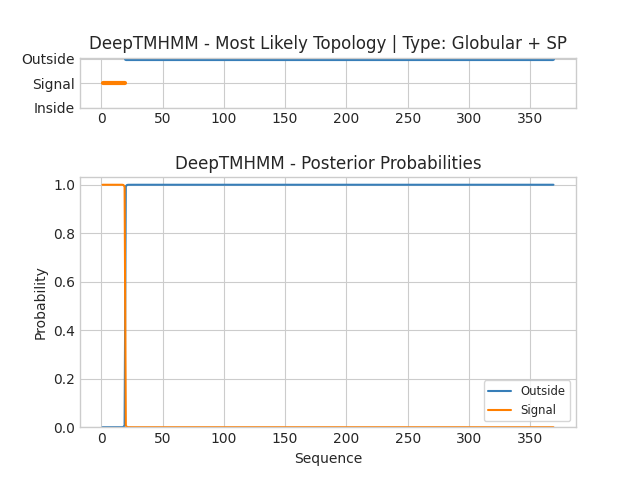

## DeepTMHMM - Predictions
Predicted topologies can be downloaded in [.gff3 format](TMRs.gff3) and [.3line format](predicted_topologies.3line)

You can download the probabilities used to generate this plot [here](Q22179|LRX-1|C.elegans_probs.csv)
### Predicted Topologies
```
>Q22179|LRX-1|C.elegans | SP
MAWLTSIFFILLAVQPVLPQDLYGTATQQQPYPYVQPSASSGSGGYVPNPQSSIHTVQQPYPNIDVVEPDVDSVDIYETEEPQFKVVNPVFPLGGSGIVEEPGTIPPPMPQTQAPEKPDNSYAINYCDKREFPDDVLAQYGLERIDYFVYNTSCSHVFFQCSIGQTFPLACMSEDQAFDKSTENCNHKNAIKFCPEYDHVMHCTIKDTCTENEFACCAMPQSCIHVSKRCDGHPDCADGEDENNCPSCARDDEFACVKSEHCIPANKRCDGVADDCEDGSNLDEIGCSKNTTCIGKFVCGTSRGGVSCVDLDMHCDGKKDCLNGEDEMNCQEGRQKYLLCENQKQSVTRLQWCNGETDCADGSDEKYCY
SSSSSSSSSSSSSSSSSSSOOOOOOOOOOOOOOOOOOOOOOOOOOOOOOOOOOOOOOOOOOOOOOOOOOOOOOOOOOOOOOOOOOOOOOOOOOOOOOOOOOOOOOOOOOOOOOOOOOOOOOOOOOOOOOOOOOOOOOOOOOOOOOOOOOOOOOOOOOOOOOOOOOOOOOOOOOOOOOOOOOOOOOOOOOOOOOOOOOOOOOOOOOOOOOOOOOOOOOOOOOOOOOOOOOOOOOOOOOOOOOOOOOOOOOOOOOOOOOOOOOOOOOOOOOOOOOOOOOOOOOOOOOOOOOOOOOOOOOOOOOOOOOOOOOOOOOOOOOOOOOOOOOOOOOOOOOOOOOOOOOOOOOOOOOOOOOOOOOOOOOOOOOOOOO

```


```
##gff-version 3
# Q22179|LRX-1|C.elegans Length: 369
# Q22179|LRX-1|C.elegans Number of predicted TMRs: 0
Q22179|LRX-1|C.elegans	signal	1	19				
Q22179|LRX-1|C.elegans	outside	20	369				

```
